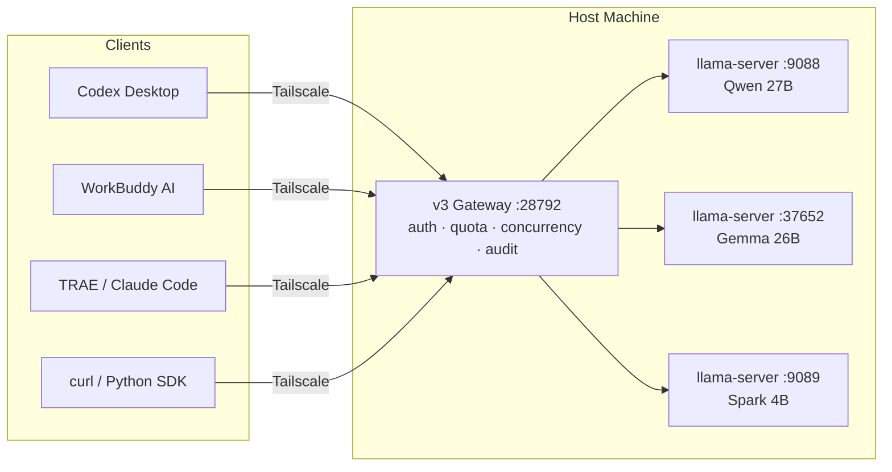

# desktop-model-gateway

**Turn one powerful Windows machine into a private AI server your whole team can use — without anyone installing anything, touching a terminal, or sending data offsite.**

> 让一个不懂命令行的团队，把一台强机的算力共享起来。

[中文教程](docs/tutorial-zh.md) · [English Tutorial](docs/tutorial-en.md)

---

## The problem this solves

You bought a big-memory workstation and got llama.cpp running. You can use it. Your colleagues cannot.

Getting from *"it runs on my machine"* to *"the whole office uses it"* is not a config change — it's a separate project:

| You have | You need |
| --- | --- |
| One llama-server port | Auth, so not everyone on the network gets free compute |
| One shared API key | Per-user keys, so you know who saturated the box |
| No limits | Quotas, so one person's `for` loop doesn't kill the machine |
| No concurrency control | A capacity limit at the measured throughput peak |
| No audit trail | A record of who ran what, when |
| Manual restarts | Self-healing: engine, gateway, and wedged-slot recovery |
| `127.0.0.1` | An address that actually works on someone else's laptop |

This repo is that project.

---

## What's in the box

| Component | What it does |
| --- | --- |
| **Gateway** (port 28792) | Auth · per-user quotas · concurrency governance · model routing · audit · Prometheus metrics |
| **Admin console** (`/admin`) | Single 47 KB HTML file. Create users, change quotas, rotate keys, watch who's using what. No build step, no CDN |
| **Electron shell** (82 MB) | Double-click → tray-resident → starts the gateway → auto-logs-in as admin |
| **Ops scripts** | Scheduled-task bootstraps, watchdog, slot-deadlock guard |
| **Load-test suite** | Concurrency / payload / stability, zero-dependency Python |

**Zero third-party runtime dependencies.** `"dependencies": {}` — HTTP, process management, config, logging, and tests all run on the Node standard library. 122 Node tests + 41 Python end-to-end checks, no test framework.

---

## Architecture



The gateway is a **credential boundary, not a transparent tunnel** — the client's `Authorization` header is stripped before the upstream hop. Otherwise your gateway key ends up in llama-server's logs.

---

## Measured, not estimated

Real load test on our hardware (AMD Ryzen AI MAX+ 395, Radeon 8060S iGPU, 128 GB unified memory, 64 GB as VRAM — **zero NVIDIA devices**):

| Concurrency | RPS | p50 latency | Errors |
| --- | --- | --- | --- |
| 1 | 0.94 | 857 ms | 0% |
| 2 | 1.71 | 862 ms | 0% |
| 4 | 3.53 | 864 ms | 0% |
| **8** | **4.24 (peak)** | **1429 ms** | **0%** |
| 16 | 3.96 | 2908 ms | 0% |
| 24 | 3.79 | 4336 ms | 0% |

**Concurrency 8 is the throughput peak — past it, throughput falls and latency grows linearly.** That's why the default limit is 8 and not 32.

| Model | Role | Prompt eval |
| --- | --- | --- |
| Gemma-4-26B Q4_K_M | default workhorse | ~946 tok/s direct, ~181 tok/s via Tailscale Funnel |
| Qwen3.8-27B Q4_K_M | heavy reasoning, batch only | ~11 tok/s — **TTFT can exceed 10 min on long system prompts** |
| Spark-X-25-4B Q4_K_M | classification, extraction, volume | fastest |

Cross-model concurrency is not free: with all three saturated, throughput drops **Gemma −72% / Spark −60% / Qwen −23%**. The iGPU's compute is shared.

---

## 30-second quick start

```bash
cd v3

# 1) Create the first admin
node src/cli.js users add --name Alice --role admin

# 2) Create a member with quotas
node src/cli.js users add --name Bob --rpm 60 --tpm 200000 --rpd 5000 --slots 2

# 3) Start the gateway
node src/server.js

# 4) Open the console — after this you never touch the CLI again
start http://127.0.0.1:28792/admin
```

**On the host machine, steps 3 and 4 are unnecessary**: double-click the desktop icon. The tray app starts the gateway, logs itself in as admin, and opens the console.

Point any OpenAI-compatible client at it:

```bash
curl -s http://<host>:28792/v1/chat/completions \
  -H "Authorization: Bearer <your-key>" \
  -H "Content-Type: application/json" \
  -d '{"model":"local-gemma-4-26b","messages":[{"role":"user","content":"ping"}]}'
```

```python
from openai import OpenAI
client = OpenAI(base_url="http://<host>:28792/v1", api_key="<your-key>")
```

---

## Client support (and each one's trap)

| Client | Config location | The one thing that bites you |
| --- | --- | --- |
| **Codex Desktop** | `$CODEX_HOME/config.toml` | `app-server` reads config **once at startup**; also verify `CODEX_HOME` — `~/.codex` may be a junction to nowhere |
| **WorkBuddy AI** | `~/.workbuddy-ai/models.json` | `url` ends in `/v1`; the app appends `/chat/completions` unless `useCustomProtocol: true` |
| **TRAE Work / SOLO** | UI (encrypted in `state.vscdb`) | The key is encrypted by a native module — **external writes get overwritten, paste it in the UI**; `base_url` stores the full endpoint, not a prefix |
| **Anything OpenAI-compatible** | — | base URL + key + model id, done |

The console generates copy-pasteable config for all of these with the key and address already filled in.

---

## Full tutorial

The README is the index. The tutorial is the substance — hardware selection, VRAM sizing, every llama.cpp flag explained, capacity planning, ops/self-healing, security checklist, and a top-10 traps table ranked by hours lost.

- **[中文完整教程](docs/tutorial-zh.md)** — 《用一台 Windows 撑起全所的私有 AI》
- **[English full tutorial](docs/tutorial-en.md)** — *Running a Private AI Stack for a Whole Office on One Windows Box*

Who it's for: professional services firms and small engineering teams (10–50 people) with a big-memory Windows host who need their data to stay on the network.

Who it's not for: 200B+ dense models, single-request latency optimization, or teams of 1–2 (just use Ollama).

---

## Honest limitations

Stated up front, because you'll hit them:

- **iGPU ceiling.** This is not a discrete-GPU cluster. Concurrency 8 is the ceiling on our hardware.
- **Slot deadlocks.** A wedged request owns its slot; `/slots/0?action=erase` returns 501, only a restart clears it. We ship a guard script, but it's a workaround, not a fix.
- **Upstream config changes need a gateway restart.** No hot reload.
- **Unknown model IDs fail silently** to `defaultUpstream`. The `model` field in the response is the ground truth.
- **Ongoing ops.** Budget 2–4 h/week for the first two months.

---

## Repo contents

```
README.md              this page
LICENSE                MIT
docs/tutorial-zh.md    full write-up (Chinese)
docs/tutorial-en.md    full write-up (English)
```

---

## Code

The gateway described here is not public yet — this repo currently publishes
the write-up and the measurements. **If you want the code, open an issue and
say what you'd use it for**; that's the fastest way to get our attention.

---

## Feedback

Issues welcome — especially measured numbers from different hardware. If your load-test curve doesn't look like ours, we want to know.
