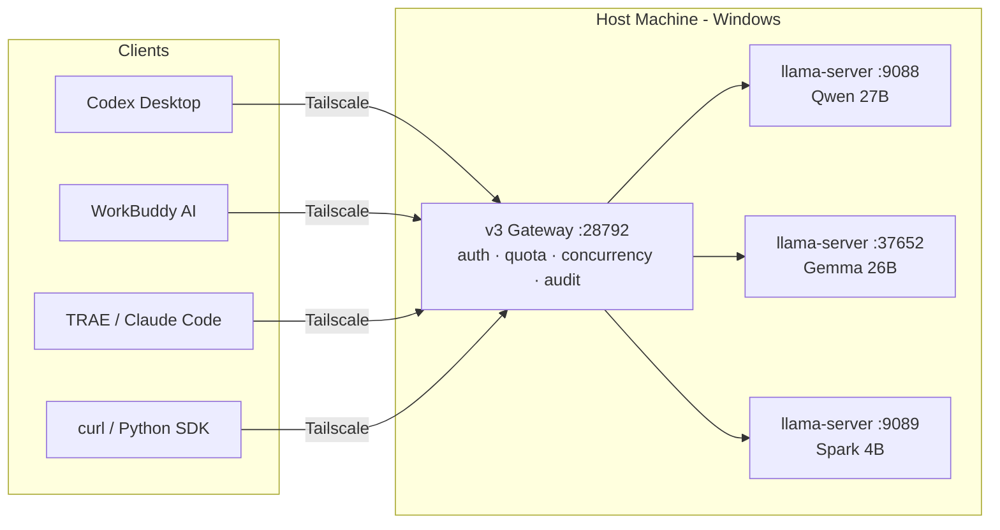

# Running a Private AI Stack for a Whole Office on One Windows Box

> A field report: sharing one local LLM host across a 10–50 person team.
>
> Last updated 2026-09-07 · Written by the desktop-model-gateway authors.
>
> Every number here comes from our own hardware, not a vendor whitepaper. Where it's slow, I say it's slow.

---

## 0. The short version

| Question | Answer |
| --- | --- |
| How big a model runs on a GPU-less Windows box? | We keep **27B + 26B + 4B resident** on 128 GB unified memory, 64 GB carved out as VRAM |
| How many people at once? | **Concurrency 8 is the throughput peak (4.24 RPS)** — 3–4 people fluid, 8–10 usable with queueing. Push past it and throughput *drops* |
| Faster than cloud APIs? | Time-to-first-token is worse locally (~857 ms vs frontier cloud). **Long-context, batch, and iterative workloads are much faster** |
| Cheaper? | Depends entirely on volume. See [§11](#11-the-cost-model) — I give you the formula, not a made-up number |
| What's actually hard? | **Not running the model. Making it usable by other people.** Model setup is 10% of the work; multi-user, quotas, self-healing and networking is the other 90% |

**Read this if**: you have a Windows machine with a lot of RAM (≥64 GB) and want your colleagues to use a local model without installing anything, touching a terminal, or sending data offsite.

**Skip this if**: you want a 200B+ dense model, you optimize for single-request latency, or your team is 1–2 people (just run Ollama locally and stop reading).

---

## 1. Why Windows + an iGPU instead of Linux + NVIDIA

This needs explaining up front, or none of the flags below make sense.

Our host is an **AMD Ryzen AI MAX+ 395 (Strix Halo)** with a Radeon 8060S integrated GPU. `nvidia-smi` reports **zero NVIDIA devices**. We picked it for one reason: memory.

- Discrete path: an RTX 4090 gives you 24 GB of VRAM. A 27B Q4_K_M is ~17 GB — it fits, barely, and you're dead the moment the context grows, because there's nothing left for KV cache.
- Strix Halo path: **128 GB unified memory, 64 GB assignable as VRAM.** Three resident models plus 8 GB of KV cache each, with half the system memory still free.

**The costs, stated plainly:**

1. **No CUDA.** llama.cpp runs Vulkan/ROCm here. `-ngl 99` offloads everything to the GPU, but the kernels aren't as fast as NVIDIA's.
2. **The iGPU is a hard ceiling.** Cross-model concurrency is *not* free — with all three models saturated we measured throughput drops of **Gemma −72% / Spark −60% / Qwen −23%**. "Three models serving three people" sounds great and feels like all three slowing down.
3. **Windows service management is primitive.** No systemd. We use **Scheduled Tasks under SYSTEM plus a watchdog** — see [§9](#9-ops-keeping-it-alive-with-nobody-watching).

On Linux, everything in this document applies except §9 (swap the watchdog for systemd units).

---

## 2. Architecture



| Layer | Job | Ours |
| --- | --- | --- |
| **Inference** | Actually runs the model | llama.cpp `llama-server` — one process, one port per model |
| **Gateway** | Auth / quota / concurrency / routing / audit | Our v3 gateway, zero third-party deps, port 28792 |
| **Network** | Lets colleagues reach the host | Tailscale — LAN-direct first, Funnel as fallback |

**Why you need the gateway layer.** Point everyone straight at llama-server ports and you hit four problems immediately:

1. No auth — anyone who scans the port gets free compute.
2. No quota — one person with a `for` loop kills the machine for everyone.
3. No concurrency control — see [§10](#10-capacity-planning-more-concurrency-is-worse): past the peak, more concurrency means *less* throughput. Someone has to hold the door.
4. **Credential leakage** — the subtle one. Transparent proxying forwards the client's `Authorization` header upstream, so your gateway key lands in upstream logs. **A gateway is a credential boundary, not a transparent tunnel.**

---

## 3. Hardware and the VRAM split

| Item | Ours | Note |
| --- | --- | --- |
| SoC | AMD Ryzen AI MAX+ 395 | Strix Halo |
| GPU | Radeon 8060S (integrated) | 0 NVIDIA devices |
| RAM | 128 GB unified | **This is the whole premise** |
| Assigned to VRAM | 64.35 GB | Set in BIOS / vendor tool |

**How much to carve out:**

```
VRAM ≥ (sum of resident model weights) × 1.2 + per-model KV cache
```

Our arithmetic:

```
Qwen 27B Q4_K_M   ≈ 17 GB
Gemma 26B Q4_K_M  ≈ 16 GB
Spark 4B  Q4_K_M  ≈  3 GB
KV cache 8 GB × 3 = 24 GB
─────────────────────────
total             ≈ 60 GB  →  assign 64 GB, leave 4 GB headroom
```

**What happens if you over-assign?** Windows starts paging and inference speed falls off a cliff — and it's miserable to diagnose because nothing looks broken. Leave the 4 GB.

**Floor spec:** with only 64 GB, assign 32 GB, keep one 27B resident with `--cache-ram 4096`, and start the rest on demand. Still worth it if your data can't leave the building.

---

## 4. Pick three models, not one big one

Counter-intuitive point #2.

Most people's instinct is "deploy the biggest model." Wrong. **Teams need a fast/slow mix:**

| Tier | Model | Use | Measured |
| --- | --- | --- | --- |
| Heavy | Qwen3.8-27B Q4_K_M | Hard reasoning, long-form writing, deep Chinese | prompt eval **~11 tok/s** (slow, best quality) |
| Mid | Gemma-4-26B Q4_K_M | **Default workhorse** — chat, code, summarization | prompt eval **~946 tok/s** direct, decode ~51 tok/s |
| Light | Spark-X-25-4B Q4_K_M | Classification, extraction, formatting, batch | Fastest; use for volume |

**Why Gemma is the default:** it's the one that passed end-to-end validation in Codex Desktop, and its prompt eval is roughly **86× faster** than Qwen's. Make the 27B the default and your team will file complaints on day one.

**Honest warning about Qwen:** with long system prompts, Qwen 27B's **time-to-first-token can exceed 10 minutes**. (Dropping `--ctx-size` from 262144 to 65536 took prompt eval from 3.6 → 11.19 tok/s, a 3.1× win; going to 32768 bought nothing more.) Qwen is a **batch** model here, not an interactive one.

**Quantization: Q4_K_M.** Q8 fits fine on 128 GB, but it roughly halves prompt eval again for a quality delta nobody on the team will notice. Q4_K_M is the team-scenario sweet spot.

---

## 5. Starting the engines

One process per model, one port each. Gemma:

```bat
llama-server.exe ^
  -m "C:/models/gemma-4-26b-Q4_K_M.gguf" ^
  --mmproj "C:/models/gemma-4-26b-mmproj.gguf" ^
  --port 37652 ^
  --host 127.0.0.1 ^
  --ctx-size 131072 ^
  --cache-ram 8192 ^
  -ngl 99 ^
  --reasoning off ^
  -np 1
```

| Flag | Value | Why |
| --- | --- | --- |
| `--host 127.0.0.1` | loopback only | **Never bind 0.0.0.0.** The gateway is the only exposed surface |
| `--ctx-size 131072` | 128K total | Note: it's the *total*, split across slots |
| `--cache-ram 8192` | 8 GB | **Highest-leverage flag.** Took Gemma's prompt eval from 356 → 946 tok/s |
| `-ngl 99` | all layers | On an iGPU you go all-in; partial offload falls back to CPU and costs ~10× |
| `--reasoning off` | disable thinking | Teams want fast and deterministic. Also keeps it consistent with the gateway's `supportsReasoning: false` |
| `-np 1` / `-np 2` | slots | The big one — see below |

**On `-np` (slots), the biggest trap:**

- `--ctx-size` is the **total**, divided evenly across slots. `-np 1` → one slot with the full 131072; `-np 2` → 65536 each.
- Our split: Gemma `-np 1` (wants long context); Qwen and Spark `-np 2` (want concurrency).
- **`--mmproj` and `--slot-save-path` are mutually exclusive.**
- **Slots deadlock.** A wedged request owns the whole slot; `/slots/0?action=erase` returns 501 and only a process restart clears it. See [§9](#9-ops-keeping-it-alive-with-nobody-watching).

**Two places to change, always.** The startup `.bat` *and* the gateway's `config.json` `extraArgs`. Editing only one is the same as editing neither — a lesson we learned the hard way.

**How to tell if an engine is alive:** send a **real request** with `max_tokens: 1` and see if it answers. **Do not trust `/slots` reporting `is_processing: false`** — during a deadlock it still says `false`, and everything looks fine.

---

## 6. The gateway: from "it runs" to "the whole office can use it"

Ours is v3 on port `28792` (the legacy v2 stays on `18792`, side by side).

### 6.1 Minimal config

```jsonc
{
  "version": 3,
  "gateway": {
    "listenHost": "0.0.0.0",
    "listenPort": 28792,
    "enableAuth": true,
    "requestTimeoutMs": 300000,
    "maxBodyBytes": 2097152,
    "globalConcurrencyLimit": 8,
    "globalQueueDepth": 16,
    "acquireTimeoutMs": 5000,
    "defaultUserConcurrentSlots": 2
  },
  "upstreams": {
    "local-gemma-4-26b":  { "baseUrl": "http://127.0.0.1:37652", "aliases": ["local.gemma4"] },
    "local-qwen3.8-27b":  { "baseUrl": "http://127.0.0.1:9088",  "aliases": ["local.qwen"] },
    "local-spark-x25-4b": { "baseUrl": "http://127.0.0.1:9089" }
  },
  "defaultUpstream": "local-gemma-4-26b"
}
```

### 6.2 Three things you must get right

**(a) One key per person. No shared key.**

```bash
node src/cli.js users add --name "Alice" --rpm 60 --tpm 200000 --rpd 5000 --slots 2
```

Per-user keys are the only way to answer "who saturated the box yesterday," and to raise one person's quota without touching anyone else.

**(b) Sliding windows, not fixed buckets.**

| Dimension | Window | On breach |
| --- | --- | --- |
| RPM | 60s sliding | `429 rate_limit_exceeded (rps)` |
| TPM | 60s sliding | `429 rate_limit_exceeded (tpm)` |
| RPD | 24h sliding | `429 quota_exceeded (daily)` |

Fixed buckets let you burn double the quota across a window boundary. Sliding windows don't.

**(c) The rejection order is deliberate:** auth → body size → quota → concurrency.

Cheap, deterministic rejections first; expensive queueing last. **Quota before concurrency** means "someone blew their quota" is never misreported as "the machine is busy" — completely different experiences for the user.

### 6.3 Credential boundary: strip the client's key

```
client ──Bearer <gateway key>──▶ gateway ──(no Authorization)──▶ llama-server
                                  │
                                  └─ upstream creds come only from config.upstreams[*].apiKey
```

Add `authorization` to your hop-by-hop stripping list. **Write a test for it** asserting the upstream never sees the gateway key. This was a real bug in our v2 and it's common in homegrown gateways.

### 6.4 An admin console, so admins never touch a terminal

Open `http://<host>:28792/admin`. Five tabs:

| Tab | Shows |
| --- | --- |
| Overview | Concurrency slot map, active members, tokens/min, usage leaderboard |
| Users & Quota | One row per person: key prefix, slot map, RPM/TPM/RPD usage bars |
| Request Log | Reverse-chronological audit tail, filterable by user and status |
| Runtime Config | Read-only view; upstream keys masked to `hasApiKey: true` |
| Metrics | Raw Prometheus text |

**"Takes effect immediately" isn't a nicety, it's a requirement.** An admin who clicks Save will not accept "please restart the gateway." The trick is to **mutate the user object in place** rather than replace it — no window where a record is swapped mid-request, so hot-patching is *safer* than restarting.

We also do one thing Ollama and llama-swap don't: when you create or rotate a key, the console hands you **copy-pasteable client config with the key and address already filled in** (Codex `config.toml`, WorkBuddy `models.json`, TRAE, curl, Python SDK). Issuing a key and telling people to go read the docs is the same as not issuing one.

### 6.5 A key appears exactly once

List endpoints never return full keys, only `apiKeyHint` (first 8 chars + `…`). The full key is returned once at **creation** and once at **rotation**. Want to see it again? Rotate.

---

## 7. Networking

### 7.1 Tailscale direct, not Funnel

| Mode | Address | Use |
| --- | --- | --- |
| **Tailnet direct** | `http://100.x.y.z:28792` | Same tailnet. **Faster, no public internet.** Default choice |
| Funnel | `https://xxx.ts.net` | Only for machines outside the tailnet |

Measured gap: prompt eval ~946 tok/s direct vs ~181 tok/s through Funnel — **5×**. Don't route through Funnel if you can avoid it.

### 7.2 Never send colleagues `127.0.0.1`

Top cause of "it's down" reports that are actually "you sent the wrong address." Score interfaces by priority:

| Score | Range | Rationale |
| --- | --- | --- |
| 3 | Tailscale `100.64.0.0/10` | Works from home too |
| 2 | LAN `10/8`, `172.16/12`, `192.168/16` | Office network only |
| 1 | Other non-private IPv4 | |
| 0 | `127/8`, `169.254/16` | Fallback; UI should flag "⚠ localhost only" |

**Tailscale outranks the LAN** because a LAN address dies the moment someone leaves the office. Worth extracting into a tested module — including one test that says: *if any real NIC exists, never return `127.0.0.1`.*

### 7.3 A Windows-specific gotcha

Tailscale Funnel's LocalAPI **only accepts the interactive user and SYSTEM**; any other account gets 401. Anything resident that touches Funnel must run as a `schtasks /RU SYSTEM` task.

---

## 8. Client setup (and each one's private trap)

All of them speak OpenAI-compatible HTTP — set `base_url` to the gateway and paste the key. But every client hides its config somewhere different:

| Client | Config | Traps |
| --- | --- | --- |
| **Codex Desktop** | `$CODEX_HOME/config.toml` | ① Check where `CODEX_HOME` actually points — `~/.codex` may be a junction, and edits there do nothing and error nothing ② `app-server` is a long-lived process and **reads config once at startup**; you must kill it and fully quit/reopen ③ `base_url` ends in `/v1` |
| **WorkBuddy AI** | `%USERPROFILE%\.workbuddy-ai\models.json` | ① Trust the path in the settings UI, not the stale one in the renderer's i18n bundle ② `url` normally ends in `/v1` and the app appends `/chat/completions`; set `useCustomProtocol: true` to opt out ③ Restart the app before the model shows in the dropdown |
| **TRAE Work / SOLO** | UI (stored encrypted in `state.vscdb`) | ① **The API key is encrypted by a native module — external writes get overwritten; you must paste it in the UI once** ② Custom entries carry a `custom_openai_compatible//` prefix ③ `base_url` stores the **full endpoint** (including `/chat/completions`), not a prefix — a "full URL" toggle controls this, and a mismatch between toggle and value shows up as a confusing 307/401 ④ Three different TRAE builds (SOLO / CN / Work) use different config paths; confirm which one is in use |

**Verify in this order:**

```bash
# 1) Prove the gateway works before blaming the client
curl -s http://<host>:28792/v1/chat/completions \
  -H "Authorization: Bearer <your-key>" \
  -H "Content-Type: application/json" \
  -d '{"model":"local-gemma-4-26b","messages":[{"role":"user","content":"ping"}],"stream":false}'

# 2) Then configure the client. Both clients fail identically but curl works
#    → gateway problem. curl works but one client fails → it's reading a
#    different config file, or that port isn't listening.
```

**Rule of thumb:** two URLs failing identically while curl succeeds means check *which config file this app actually reads* and *whether that port is actually listening*. That's 80% of our debugging time.

```python
from openai import OpenAI
client = OpenAI(base_url="http://100.x.y.z:28792/v1", api_key="<your-key>")
print(client.chat.completions.create(
    model="local-gemma-4-26b",
    messages=[{"role": "user", "content": "hello"}]).choices[0].message.content)
```

---

## 9. Ops: keeping it alive with nobody watching

No systemd on Windows, so: **Scheduled Tasks + watchdog**.

### 9.1 Three layers

| Layer | Mechanism | Handles |
| --- | --- | --- |
| Engine | `schtasks /RU SYSTEM` launches `llama-server` at boot | Machine restart |
| Gateway | SYSTEM task `DmGwV3_Watchdog`, probes `/health` every minute | Gateway crash (the watchdog's watchdog) |
| **Slot** | `slot-guard.ps1` every 15 min | llama-server **alive but wedged** |

The third layer is the one people forget and the one that bites. Detection: same `id_task`, `n_decoded > 0`, and **zero growth for 600 s** → restart just that engine, matched by port, with a 15-minute cooldown.

**Don't use `taskkill /F /IM llama-server.exe`** — with three instances on one box, that kills all three.

### 9.2 Liveness, done right

```
✗ /slots is_processing: false    ← also false during a deadlock
✓ send a real request with max_tokens: 1 and see if it answers
```

### 9.3 Changed an upstream?

**No hot reload. Restart the gateway.** Everyone forgets this, including us.

### 9.4 Unknown model IDs fail silently

A model ID that isn't in the config doesn't error — it silently falls back to `defaultUpstream`. **The `model` field in the response is the ground truth.** That's where to look when you asked for Qwen and Gemma answered.

---

## 10. Capacity planning: more concurrency is worse

The most valuable table in this document. Real load test on our hardware:

| Concurrency c | RPS | p50 latency | Error rate |
| --- | --- | --- | --- |
| 1 | 0.94 | 857 ms | 0% |
| 2 | 1.71 | 862 ms | 0% |
| 4 | 3.53 | 864 ms | 0% |
| **8** | **4.24 (peak)** | **1429 ms** | **0%** |
| 16 | 3.96 | 2908 ms | 0% |
| 24 | 3.79 | 4336 ms | 0% |

**c=8 is the throughput peak. Beyond it, throughput falls and latency grows linearly.**

So `globalConcurrencyLimit: 8` isn't conservatism — **8 *is* this machine's capacity point**. Excess requests should **wait in the queue**, not be admitted to slow everyone down together. Two slots per user × 4 users = 8, which lines up with a 3–4 person target.

### Cross-model concurrency isn't free

With all three models saturated:

| Model | Throughput drop |
| --- | --- |
| Gemma | **−72%** |
| Spark | **−60%** |
| Qwen | **−23%** |

**The iGPU's compute is shared.** Real capacity isn't "3 models × 8 concurrent" — it's "8 concurrent globally, discounted when requests spread across models."

### Queueing has to actually queue

We once added a "no permit available → fail immediately" short-circuit. The result: the queue never holds a waiter, i.e. **queueing was silently disabled**. It's gone now, with a regression test. Correct behavior: the queue absorbs bursts, and a request that waits 200 ms gets served rather than rejected. That's what sharing one machine across a team should feel like.

---

## 11. The cost model

Cloud API pricing moves too fast for me to hardcode numbers. Here's the formula:

```
Payback months = hardware capex / (monthly cloud spend − monthly incremental power)

Monthly cloud spend = Σ (monthly tokens per model × current unit price) + seat price × headcount
```

**Three conditions for local to actually win.** Miss one and it doesn't:

1. **High volume with a long tail** — batch document processing, iteratively revised drafts, automated review in CI. These are brutally expensive per-token in the cloud.
2. **Data can't leave the network** — not a money question, a compliance one. For law firms, healthcare, and finance this is usually decisive.
3. **Team of 3–30** — smaller and the machine idles; larger and the iGPU ceiling forces you onto real discrete GPUs.

**The hidden cost people forget:** ops labor. Budget 2–4 hours a week for the first two months (tuning, clearing wedges, helping colleagues configure clients), settling under an hour a month afterward. The three healing layers in §9 exist to drive that number down.

---

## 12. Pre-launch security checklist

- [ ] Engines on `--host 127.0.0.1`; **only the gateway listens on 0.0.0.0**
- [ ] `enableAuth: true`, one key per person, no shared key
- [ ] Inbound `Authorization` stripped; no gateway key in upstream logs
- [ ] Concurrency limit set from [§10](#10-capacity-planning-more-concurrency-is-worse) measurements, not vibes (not 32)
- [ ] RPM/TPM/RPD set per user — nobody is unlimited
- [ ] Audit JSONL enabled with rotation (we rotate at 50 MiB)
- [ ] Slot watchdog registered
- [ ] No keys in the repo: config lives in `%ProgramData%`, repo ships only `.example`
- [ ] `/api/admin/*` requires `role=admin`; **block demoting or deleting the last admin** (or you lock yourself out)
- [ ] `/admin` sends `X-Frame-Options: DENY` + `Referrer-Policy: no-referrer` (the page injects the key into `fetch`)

---

## 13. Top 10 traps, ranked by hours lost

| # | Trap | Symptom | Fix |
| --- | --- | --- | --- |
| 1 | Sending `127.0.0.1` to colleagues | "Can't connect" — works fine for you | [§7.2](#72-never-send-colleagues-127001) scoring logic |
| 2 | Config edit does nothing | Old behavior persists | ① engine flags live in both the `.bat` and `config.json` ② upstream changes need a gateway restart ③ clients read config once at startup |
| 3 | Wedged slot | Process up, port up, no answers | Real-request probe + slot guard |
| 4 | `/slots` says idle | It's deadlocked | Don't trust `is_processing`; send a real request |
| 5 | Concurrency set to 32 | Throughput drops, latency doubles | Set it at the measured peak (8 for us) |
| 6 | VRAM over-assigned | Sudden speed collapse, hard to trace | Leave ≥4 GB for the OS |
| 7 | Unknown model ID | Silently used a different model | The response's `model` field is the truth |
| 8 | Cross-model concurrency | Three people slow down together | iGPU compute is shared; discount capacity |
| 9 | Gateway key in upstream logs | Security incident | Strip inbound `Authorization` |
| 10 | `taskkill /F /IM llama-server.exe` | Kills all three engines | Target by port |

---

## 14. How long does this take to replicate?

| Phase | Effort | Result |
| --- | --- | --- |
| Hardware + VRAM split | 0.5 day | A host that can run models |
| One llama-server working | 0.5 day | You can use it |
| Three engines + tuning | 1 day | A usable fast/slow mix |
| Gateway + users + quotas | 2–3 days | Colleagues can use it |
| Client setup (each) | 0.5 day each | Colleagues *will* use it |
| Self-healing + watchdog | 1 day | You stop firefighting |
| **Total** | **~1 week** | |

Rows 4–6 dominate. **Between "it runs" and "the whole office can use it" sits an entire engineering project.**

---

## Appendix: the project

The gateway described here is v3 of **desktop-model-gateway**:

- Zero third-party runtime dependencies (`"dependencies": {}`) — HTTP, process management, config, logging and tests all on the Node standard library
- 122 Node tests + 41 Python end-to-end checks, no test framework
- Browser admin console (single 47 KB HTML file — no build step, no CDN requests)
- Electron shell (82 MB installer): double-click → tray-resident → starts the gateway → auto-logs-in as admin

Client integration snippets are in [§8](#8-client-setup-and-each-ones-private-trap) above. The gateway code isn't public yet — open an issue describing your use case if you want it.

---

## License & feedback

Reproduce freely with attribution. Issues welcome — especially if your hardware differs and your measurements don't match ours. That data is genuinely useful to us.
