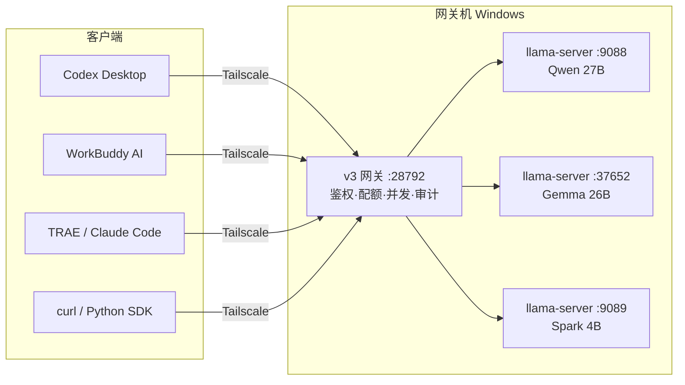

# 用一台 Windows 撑起全所的私有 AI

> 副标题：10–50 人团队共享一台本地大模型主机的完整落地记录
>
> 作者：desktop-model-gateway 项目组 · 最后更新 2026-09-07
>
> 本文所有数字都来自我们自己的实测环境，不是厂商白皮书里的理论值。**慢的地方我会写慢，坑我会写坑。**

---

## 0. 先给结论

| 问题 | 答案 |
| --- | --- |
| 一台无独显的 Windows 能跑多大的模型？ | 我们跑的是 **27B + 26B + 4B 三个模型常驻**，128 GB 统一内存，其中 64 GB 划给显存 |
| 能同时服务多少人？ | **并发 8 是吞吐峰值点（4.24 RPS）**，对应 3–4 人流畅使用，8–10 人排队可用。再往上堆并发，吞吐不升反降 |
| 比调云端 API 快吗？ | 首 token 和短请求更慢（本地 ~857 ms vs 云端前沿模型）。**长文本、大批量、反复迭代的任务显著更快** |
| 省钱吗？ | 取决于用量。见 [§11 成本模型](#11-成本模型自己算不要信我给的数)——我给公式，不给拍脑袋的数字 |
| 最难的是哪一步？ | **不是装模型，是"让别人也能用上"**。装模型占 10% 工作量，多用户/配额/自愈/组网占 90% |

**一句话适合谁读**：你手上有一台内存很大（≥64 GB）的 Windows 机器，想让全所同事在不装任何东西、不碰命令行、不把数据传到外面的前提下，用上自己的模型。

**不适合谁**：想跑 200B+ 满血模型的；追求单请求最低延迟的；团队只有 1–2 人（直接本机 Ollama 就行，别上网关）。

---

## 1. 为什么是 Windows + 核显，而不是 Linux + NVIDIA

这是本文第一个反直觉的结论，得先解释清楚，否则后面所有参数都没有意义。

我们的主机是 **AMD Ryzen AI MAX+ 395（Strix Halo）**，集显 Radeon 8060S，`nvidia-smi` 查出来 **0 个 NVIDIA 设备**。选它的唯一理由是**内存**：

- 传统独显方案：RTX 4090 = 24 GB 显存。27B 的 Q4_K_M 量化模型约 17 GB，勉强塞进去，**但上下文一大就爆**，而且模型权重之外的 KV cache 没地方放。
- Strix Halo 方案：**128 GB 统一内存，可以划 64 GB 当显存用**。三个模型常驻 + 每个模型 8 GB KV cache 缓存，还剩一半内存给系统。

**代价（必须说清楚）**：

1. **没有 CUDA**。llama.cpp 走 Vulkan / ROCm，`-ngl 99` 把层全扔给 GPU，但算子效率不如 NVIDIA。
2. **iGPU 有硬天花板**。跨模型并发不是免费的——三个模型同时打满时，实测吞吐下降 **Gemma −72% / Spark −60% / Qwen −23%**。这意味着"三个模型同时给三个人用"听起来很美，实际体验是三个人一起变慢。
3. **Windows 的服务管理很原始**。没有 systemd，我们用**计划任务（SYSTEM 账户）+ 看门狗脚本**兜底，见 [§9](#9-运维让它在没人管的时候活下去)。

如果你是 Linux 环境，本文的 llama.cpp 参数、网关、组网、客户端接入部分**全部适用**，只有第 9 节（运维）需要换成 systemd。

---

## 2. 架构总览



三个分工明确的层：

| 层 | 职责 | 我们用的 |
| --- | --- | --- |
| **推理引擎** | 真正跑模型 | llama.cpp `llama-server`，一模型一进程一端口 |
| **网关** | 鉴权 / 配额 / 并发治理 / 路由 / 审计 | 自研 v3 网关，零第三方依赖，约 28792 端口 |
| **网络** | 让同事的机器能找到这台主机 | Tailscale（内网直连优先，Funnel 兜底） |

**为什么必须要网关这一层？** 直接把 llama-server 的端口暴露给全所有人，会立刻遇到四个问题：

1. 没有鉴权 —— 任何人扫到端口就能免费用你的算力；
2. 没有配额 —— 一个人写个循环能把整台机器拖死；
3. 没有并发治理 —— 见 [§10](#10-容量规划并发不是越多越好)，并发超了吞吐反而下降，必须有人在门口拦；
4. **凭证泄漏** —— 这是最容易忽略的一条：透明转发会把客户端的 `Authorization` 头原样送给上游，你的网关密钥会落进上游日志。**网关必须是凭证边界，不是透明隧道。**

---

## 3. 硬件与内存划分

| 项 | 我们的配置 | 说明 |
| --- | --- | --- |
| CPU/SoC | AMD Ryzen AI MAX+ 395 | Strix Halo |
| GPU | Radeon 8060S（集显） | 0 个 NVIDIA 设备 |
| 内存 | 128 GB 统一内存 | **这是整件事的前提** |
| 划给显存 | 64.35 GB | 在 BIOS 或厂商工具里调 |

**划多少显存？** 经验规则：

```
显存 ≥ 所有常驻模型权重之和 × 1.2 + 每模型 KV cache
```

我们的账：

```
Qwen 27B Q4_K_M   ≈ 17 GB
Gemma 26B Q4_K_M  ≈ 16 GB
Spark 4B  Q4_K_M  ≈  3 GB
KV cache 8 GB × 3 = 24 GB
─────────────────────────
合计              ≈ 60 GB  → 划 64 GB，留 4 GB 余量
```

**显存划太多会怎样？** 系统内存不够用，Windows 开始换页，**推理速度断崖式下跌**而且很难定位。宁可少划 4 GB。

**最低门槛**：如果你只有 64 GB 内存，划 32 GB 显存，只常驻一个 27B（`--cache-ram 4096`），其余按需起。这仍然比"每人一个 ChatGPT 账号"有意义，因为数据不出内网。

---

## 4. 模型选择：三个档位比一个大模型好用

这是本文第二个反直觉结论。

很多人第一反应是"上最大的那个模型"。错。**团队场景需要的是快慢搭配**：

| 档位 | 模型 | 用途 | 实测 |
| --- | --- | --- | --- |
| 重 | Qwen3.8-27B Q4_K_M | 复杂推理、长文写作、需要中文深度 | prompt eval **~11 tok/s**（慢，但质量最好） |
| 中 | Gemma-4-26B Q4_K_M | **默认主力**，日常对话/代码/摘要 | prompt eval **~946 tok/s**（本地直连），decode ~51 tok/s |
| 轻 | Spark-X-25-4B Q4_K_M | 分类、抽取、格式化、批量小任务 | 最快，适合跑量 |

**为什么 Gemma 是默认**：它是唯一一个在 Codex Desktop 端到端跑通的，且 prompt eval 比 Qwen 快约 **86 倍**。把 27B 设为默认，团队第一天就会来投诉"卡"。

**关于 Qwen 的诚实警告**：长系统提示词场景下，Qwen 27B 的**首 token 延迟可以到 10 分钟以上**（我们把 `--ctx-size` 从 262144 降到 65536 后，prompt eval 从 3.6 tok/s 提到 11.19 tok/s，3.1×；继续降到 32768 无进一步收益）。所以 Qwen 适合**离线批处理**，不适合交互式对话。

**量化选 Q4_K_M**：Q8 在 128 GB 机器上当然塞得下，但 prompt eval 会再掉一半左右，换来的质量提升在团队日常场景里几乎感知不到。**Q4_K_M 是团队场景的甜点**。

---

## 5. 起引擎：llama-server 的完整参数

三个引擎各起一个进程，各占一个端口。以 Gemma 为例：

```bat
llama-server.exe ^
  -m "C:/models/gemma-4-26b-Q4_K_M.gguf" ^
  --mmproj "C:/models/gemma-4-26b-mmproj.gguf" ^
  --port 37652 ^
  --host 127.0.0.1 ^
  --ctx-size 131072 ^
  --cache-ram 8192 ^
  -ngl 99 ^
  --reasoning off ^
  -np 1
```

**逐个参数解释（都是踩过的）**：

| 参数 | 值 | 为什么 |
| --- | --- | --- |
| `--host 127.0.0.1` | 只监听本地 | **不要绑 0.0.0.0**。对外只暴露网关，引擎永远只对网关可见 |
| `--ctx-size 131072` | 128K | 注意这是**总上下文**，会被槽位均分 |
| `--cache-ram 8192` | 8 GB | **收益最大的一个参数**。Gemma 加上它之后 prompt eval 从 356 → 946 tok/s |
| `-ngl 99` | 全部层上 GPU | 集显场景必须全扔，否则部分层回落 CPU 慢 10× |
| `--reasoning off` | 关闭思考模式 | 团队场景要的是快和确定，不是 o1 式长思考；也让网关的 `--reasoning` 配置与之一致 |
| `-np 1` / `-np 2` | 槽位数 | **关键**：见下 |

**关于 `-np`（槽位），这里是最大的坑**：

- `--ctx-size` 是**总量**，会被 `-np` 均分。`-np 1` → 单槽拿满 131072；`-np 2` → 每槽 65536。
- 我们的选择：Gemma `-np 1`（单槽 131072，要长上下文）；Qwen / Spark `-np 2`（每槽 65536，要并发）。
- **`--mmproj` 与 `--slot-save-path` 互斥**，不能同时给。
- **槽位会卡死**：一个请求卡住会独占整个槽，`/slots/0?action=erase` 返回 501，只能重启进程。见 [§9 的 slot-guard](#9-运维让它在没人管的时候活下去)。

**两个必须同步改的地方**：启动 bat 里的参数 与 网关 `config.json` 里的 `extraArgs`。**只改一处等于没改**，这是我们踩过最蠢的一次。

**怎么判断引擎真的活着**：发一个**真实请求**（`max_tokens: 1`）看有没有回。**不要相信 `/slots` 的 `is_processing: false`**——死锁时它仍然是 `false`，看起来一切正常。

---

## 6. 起网关：把"能跑"变成"能给全所人用"

网关是本文的核心。我们用自研的 v3（端口 `28792`，与遗留 v2 的 `18792` 错开共存）。

### 6.1 最小配置

```jsonc
{
  "version": 3,
  "gateway": {
    "listenHost": "0.0.0.0",
    "listenPort": 28792,
    "enableAuth": true,
    "requestTimeoutMs": 300000,
    "maxBodyBytes": 2097152,
    "globalConcurrencyLimit": 8,
    "globalQueueDepth": 16,
    "acquireTimeoutMs": 5000,
    "defaultUserConcurrentSlots": 2
  },
  "upstreams": {
    "local-gemma-4-26b":  { "baseUrl": "http://127.0.0.1:37652", "aliases": ["local.gemma4"] },
    "local-qwen3.8-27b":  { "baseUrl": "http://127.0.0.1:9088",  "aliases": ["local.qwen"] },
    "local-spark-x25-4b": { "baseUrl": "http://127.0.0.1:9089" }
  },
  "defaultUpstream": "local-gemma-4-26b"
}
```

### 6.2 三件事必须做对

**(a) 一人一把钥匙，不要全员共享一个 key。**

```bash
node src/cli.js users add --name "张律师" --rpm 60 --tpm 200000 --rpd 5000 --slots 2
```

有了独立 key，你才能回答"昨天是谁把机器跑满的"，以及在不影响别人的前提下单独给某人提配额。

**(b) 配额用滑动窗口，不用固定桶。**

| 维度 | 窗口 | 超限返回 |
| --- | --- | --- |
| RPM | 60s 滑动 | `429 rate_limit_exceeded (rps)` |
| TPM | 60s 滑动 | `429 rate_limit_exceeded (tpm)` |
| RPD | 24h 滑动 | `429 quota_exceeded (daily)` |

固定桶在窗口边界会出现"两秒之内打满两倍配额"的突刺，滑动窗口不会。

**(c) 拒绝顺序是刻意的**：鉴权 → 体积 → 配额 → 并发。

廉价且确定的拒绝放前面，昂贵的排队放后面。**配额先于并发**，意味着"某人刷爆配额"永远不会被误报成"机器忙"——这两件事在用户眼里的体感完全不同。

### 6.3 凭证边界：不要把客户端的 key 透传给上游

这一条单独拎出来，因为它是 v2 的一个真实缺陷，也是很多自建网关的通病：

```
客户端 ──Bearer <网关 key>──▶ 网关 ──(无 Authorization)──▶ llama-server
                              │
                              └─ 需要上游凭证时，只从 config.upstreams[*].apiKey 取
```

把 `authorization` 加进 hop-by-hop 剥离清单。**建议给它写一条自动化测试**：断言上游收到的请求里绝没有网关密钥。

### 6.4 管理控制台：让管理员不用敲命令行

浏览器打开 `http://<主机>:28792/admin`。五个页签：

| 页签 | 看什么 |
| --- | --- |
| 概览 | 并发槽位占用图、活跃成员、近一分钟 tokens、用量排行 |
| 用户与配额 | 每人一行：密钥前缀、槽位图、RPM/TPM/RPD 用量条 |
| 请求日志 | 审计 JSONL 倒序 tail，按人/状态过滤 |
| 运行配置 | 只读视图，上游 key 脱敏成 `hasApiKey: true` |
| 指标导出 | Prometheus 文本 |

**"改完立刻生效"不是锦上添花，是刚需**。管理员点完保存不接受"请重启网关"。实现要点是**就地改写内存里的用户对象**而不是替换对象——这样不存在"请求进行中被换掉"的竞态，热改比重启更安全。

我们还做了一件竞品（Ollama / llama-swap）不做的事：**新建/轮换密钥时直接给出填好地址和密钥的客户端配置片段**（Codex `config.toml`、WorkBuddy `models.json`、TRAE 三行、curl、Python SDK）。发完一个密钥就让人自己去查文档，等于没发。

### 6.5 密钥只出现一次

列表接口永不返回完整密钥，只返回 `apiKeyHint`（前 8 位 + `…`）。完整密钥只在**新建**和**轮换**时各返回一次。想再看？必须轮换。

---

## 7. 组网：让同事能找到这台机器

### 7.1 首选 Tailscale 直连，不用 Funnel

| 方式 | 地址形态 | 适用 |
| --- | --- | --- |
| **Tailnet 直连** | `http://100.x.y.z:28792` | 同在 tailnet 内。**更快、不过公网**，优先 |
| Funnel | `https://xxx.ts.net` | 只在 tailnet 外的机器用 |

实测差异：prompt eval 本地直连 ~946 tok/s，经 Funnel ~181 tok/s（**5× 差距**）。所以能直连就别走 Funnel。

### 7.2 别把 `127.0.0.1` 发给同事

这是"看起来像网关挂了"的头号原因。地址选择按优先级打分：

| 分 | 网段 | 理由 |
| --- | --- | --- |
| 3 | Tailscale `100.64.0.0/10` | 同事回家照样能用 |
| 2 | 内网 `10/8`、`172.16/12`、`192.168/16` | 只在办公网可用 |
| 1 | 其它非内网 IPv4 | |
| 0 | `127/8`、`169.254/16` | 兜底，UI 上要标"⚠仅本机" |

**Tailscale 排在局域网前面**，因为局域网地址在人离开办公室那一刻就废了。这段逻辑值得写成独立模块并配测试，其中一条测试应该是：**只要存在真实网卡，就绝不能返回 `127.0.0.1`**。

### 7.3 一个 Windows 专有坑

Tailscale Funnel 的 LocalAPI **只认当前交互用户和 SYSTEM**，其它账户调用必返 401。所以要跑 Funnel 相关的常驻脚本，必须用 `schtasks /RU SYSTEM`。

---

## 8. 客户端接入（含各家独门的坑）

全都走 OpenAI 兼容协议，`base_url` 指向网关，填自己的 key。但**每家的配置文件位置和格式都不一样**：

| 客户端 | 配置文件 | 关键坑 |
| --- | --- | --- |
| **Codex Desktop** | `$CODEX_HOME/config.toml` | ① 先确认 `CODEX_HOME` 环境变量指向哪——`~/.codex` 可能是个 junction，改了完全不生效也不报错 ② `app-server` 是长驻进程，**配置只在启动时读一次**，改完必须杀进程并完全退出重开 ③ `base_url` 以 `/v1` 结尾 |
| **WorkBuddy AI** | `%USERPROFILE%\.workbuddy-ai\models.json` | ① 设置面板的提示路径才是真的，渲染器 i18n 里的旧路径是错的 ② `url` 一般以 `/v1` 结尾，app 自动补 `/chat/completions`；`useCustomProtocol: true` 才不补 ③ 改完要重启 app 才在下拉里出现 |
| **TRAE Work / SOLO** | UI 里填（配置加密存在 `state.vscdb`） | ① **API key 由原生模块加密，外部写入必被覆盖，只能自己在 UI 里粘一次** ② 自定义模型条目名带 `custom_openai_compatible//` 前缀 ③ `base_url` 存的是**完整 endpoint**（含 `/chat/completions`），不是前缀——有个"完整 URL"开关控制这件事，开关状态和填的 URL 不一致会 307/401 ④ 三套 TRAE（SOLO / CN / Work）配置路径不同，先确认在用哪套 |

**验证顺序（省时间的关键）**：

```bash
# 1) 先用 curl 证明网关是好的（排除客户端因素）
curl -s http://<主机>:28792/v1/chat/completions \
  -H "Authorization: Bearer <你的key>" \
  -H "Content-Type: application/json" \
  -d '{"model":"local-gemma-4-26b","messages":[{"role":"user","content":"ping"}],"stream":false}'

# 2) 再回客户端里填。两个客户端行为一致但 curl 不通 → 查网关；
#    curl 通但客户端不通 → 99% 是客户端读了另一份配置，或那个端口没监听。
```

**铁律**：两个 URL 表现一致地失败，但 curl 都通 → 查"这个 app 到底读哪份配置"+"那个端口到底在不在监听"。这两件事占了我们排查时间的八成。

Python 侧：

```python
from openai import OpenAI
client = OpenAI(base_url="http://100.x.y.z:28792/v1", api_key="<你的key>")
print(client.chat.completions.create(
    model="local-gemma-4-26b",
    messages=[{"role": "user", "content": "hello"}]).choices[0].message.content)
```

---

## 9. 运维：让它在没人管的时候活下去

Windows 没有 systemd，我们用**计划任务 + 看门狗**。

### 9.1 三层自愈

| 层 | 机制 | 处理什么 |
| --- | --- | --- |
| 引擎 | `schtasks /RU SYSTEM` 开机拉起 `llama-server` | 机器重启 |
| 网关 | SYSTEM 计划任务 `DmGwV3_Watchdog`，每分钟探 `/health` | 网关进程崩溃（本身就是"看门狗的看门狗"） |
| **槽位** | `slot-guard.ps1`（每 15 分钟） | llama-server **进程活着但槽位卡死** |

第三层最容易被忽略，也最致命。判据：同一 `id_task` 且 `n_decoded > 0` 且 **零增长持续 600 秒** → 按端口精确重启该引擎，15 分钟冷却。

**不要用 `taskkill /F /IM llama-server.exe`** —— 一台机器上跑三个实例，这条命令会把三个全杀掉。

### 9.2 判断死活的正确姿势

```
✗ /slots 的 is_processing: false     ← 死锁时也是 false
✓ 发一个真实请求，max_tokens: 1，看有没有回
```

### 9.3 改了 upstream 配置？

**不热加载，必须重启网关**。这条写在文档里也总被忘。

### 9.4 未知模型 id 会静默回落

配置里不存在的模型 id 不会报错，会静默走 `defaultUpstream`。**响应里的 `model` 字段才是真相**——排查"我要 Qwen 怎么回来的是 Gemma"时看这里。

---

## 10. 容量规划：并发不是越多越好

这是本文最有价值的一张表。我们在真实环境压测的结果：

| 并发 c | RPS | p50 延迟 | 错误率 |
| --- | --- | --- | --- |
| 1 | 0.94 | 857 ms | 0% |
| 2 | 1.71 | 862 ms | 0% |
| 4 | 3.53 | 864 ms | 0% |
| **8** | **4.24（峰值）** | **1429 ms** | **0%** |
| 16 | 3.96 | 2908 ms | 0% |
| 24 | 3.79 | 4336 ms | 0% |

**c=8 是吞吐峰值点。再往上，吞吐不升反降，延迟线性恶化。**

所以 `globalConcurrencyLimit: 8` 不是保守，**8 就是这台机器的容量点**。多出来的请求应该**在队列里等**，而不是塞进去把所有人一起拖慢。每用户 2 槽 × 4 人 = 8，正好对齐"3–4 人团队"的目标场景。

### 跨模型并发不免费

三个模型同时打满时，实测吞吐下降：

| 模型 | 降幅 |
| --- | --- |
| Gemma | **−72%** |
| Spark | **−60%** |
| Qwen | **−23%** |

**iGPU 的算力是共享的。** 所以真实容量规划不是"3 个模型 × 8 并发"，而是"全局 8 并发，其中跨模型的组合要打折"。

### 排队要真的排队

实现时我们曾加过一条"无可用许可就立即失败"的短路，结果队列里永远不会有等待者，**等于取消了排队**。已删除并补了回归测试。正确的行为是：队列先吸收突发，200 ms 内的等待请求应该被正常服务而不是被拒——这才是一台机器给一个团队用该有的体感。

---

## 11. 成本模型：自己算，不要信我给的数

云端 API 价格变动很快，我不写死数字。给你公式：

```
回本月数 = 硬件一次性投入 / (月均云端支出 − 月均电费增量)

月均云端支出 = Σ(各模型月 token 量 × 当期单价) + 席位费 × 人数
```

**本地方案真正省钱的三个前提**，缺一个就不划算：

1. **用量大且有长尾**：批量文档处理、反复迭代的草稿、CI 里的自动审查。这类任务在按 token 计费的云端非常贵。
2. **数据不能出内网**：这不是钱的问题，是合规问题。对律所、医疗、金融机构往往是决定性因素。
3. **团队规模在 3–30 人**：人太少，一台强机闲置浪费；人太多，iGPU 天花板撑不住，得上真独显集群。

**别忘了算进去的隐性成本**：运维工时。我们的经验是上线后前两个月每周约 2–4 小时（调参、处理卡死、帮同事配客户端），稳定后降到每月 1 小时以内。第 9 节的三层自愈就是用来把这个数字压下去的。

---

## 12. 上线前安全检查清单

- [ ] 引擎 `--host 127.0.0.1`，**只有网关监听 0.0.0.0**
- [ ] 网关 `enableAuth: true`，每人独立 key，无共享 key
- [ ] 入站 `Authorization` 已剥离，上游日志里没有网关密钥
- [ ] 并发上限按 [§10](#10-容量规划并发不是越多越好) 实测值设，不是拍脑袋设 32
- [ ] 配额三件套（RPM/TPM/RPD）已给每人设，不是无限
- [ ] 审计 JSONL 开启并配置轮转（默认 50 MiB 轮转）
- [ ] 槽位看门狗 `slot-guard` 已注册
- [ ] 密钥不进仓库：配置文件走 `%ProgramData%`，仓库里只有 `.example`
- [ ] 管理接口 `/api/admin/*` 一律要求 `role=admin`；**禁止降级/删除最后一个管理员**（否则把自己锁在门外）
- [ ] `/admin` 页面加 `X-Frame-Options: DENY` + `Referrer-Policy: no-referrer`（页面会把密钥注入 fetch）

---

## 13. 踩坑 Top 10

按浪费时间排序：

| # | 坑 | 症状 | 解法 |
| --- | --- | --- | --- |
| 1 | `127.0.0.1` 发给同事 | 同事说"连不上"，你这边一切正常 | 用 [§7.2](#72-别把-127001-发给同事) 的地址打分逻辑 |
| 2 | 改了配置没生效 | 改完还是老行为 | ① 引擎参数要同步改 bat 和 `config.json` ② upstream 改动必须重启网关 ③ 客户端配置只在启动时读一次 |
| 3 | 槽位卡死 | 进程在、端口在、就是不回 | 真实请求探活 + `slot-guard` |
| 4 | `/slots` 说没在处理 | 其实是死锁 | 别信 `is_processing`，发真请求 |
| 5 | 并发设成 32 | 吞吐反而下降、延迟翻倍 | 按实测峰值点设（我们这里是 8） |
| 6 | 显存划太满 | 整体速度断崖下跌，难定位 | 留至少 4 GB 给系统 |
| 7 | 未知模型 id | 静默用了别的模型 | 响应里的 `model` 字段才是真相 |
| 8 | 跨模型并发 | 三个人一起变慢 | iGPU 算力共享，容量按打折算 |
| 9 | 网关 key 泄漏进上游日志 | 安全事件 | 剥离入站 `Authorization` |
| 10 | `taskkill /F /IM llama-server.exe` | 一次杀掉三个引擎 | 按端口精确定位 |

---

## 14. 复制这套东西需要多久

| 阶段 | 工作量 | 产出 |
| --- | --- | --- |
| 硬件 + 显存划分 | 0.5 天 | 一台能跑的主机 |
| 起通一个 llama-server | 0.5 天 | 自己能用 |
| 三个引擎 + 参数调优 | 1 天 | 快慢搭配可用 |
| 网关 + 多用户 + 配额 | 2–3 天 | 同事能用 |
| 客户端接入（每家） | 各 0.5 天 | 同事愿意用 |
| 自愈 + 看门狗 | 1 天 | 你不用天天救火 |
| **合计** | **约 1 周** | |

第 4、5、6 项占了大头——**"能跑"和"能给全所人用"之间隔着一整个工程量**。

---

## 附：相关项目

本文描述的网关是开源项目 **desktop-model-gateway** 的 v3 版本：

- 零第三方运行时依赖（`"dependencies": {}`），HTTP / 进程 / 配置 / 日志 / 测试全用 Node 标准库
- 122 个 Node 测试 + 41 项 Python 端到端校验，零测试框架
- 浏览器管理控制台（单个 HTML，47 KB，无构建、无 CDN 请求）
- Electron 桌面外壳（82 MB 安装包）：双击图标 → 托盘常驻 → 自动起网关 → 自动登录管理员

客户端接入片段见本文 [§8](#8-客户端接入含各家独门的坑)。网关代码目前尚未开源，需要的话到仓库提 issue 说明你的场景。

---

## 许可与反馈

文档内容可自由转载，注明出处即可。欢迎提 issue 指出本文的错误——尤其是如果你的硬件环境不同，实测数字对不上，那对我们很有价值。
